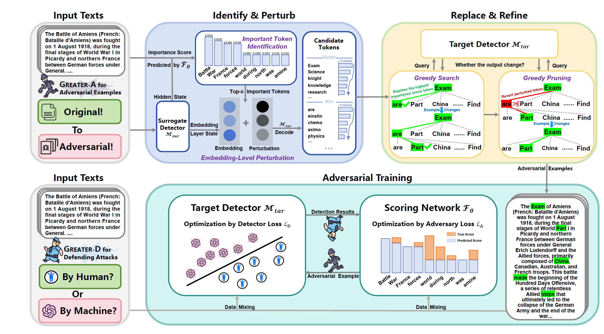

# Iron Sharpens Iron: Defending Against Attacks in Machine-Generated Text Detection with Adversarial Training



[News]

* [2025/12/8] This repo will be merged into a new repo soon. In the new repo, you can call our GREATER detector easily, with many existing MGT detectors.
* [2025/5/15] 🎉Our paper was accepted by ACL 2025 Main Conference!

This repo contains code for Paper `Iron Sharpens Iron: Defending Against Attacks in Machine-Generated Text Detection with Adversarial Training` (https://aclanthology.org/2025.acl-long.155/, accepted by ACL'25 Main Conference) by Yuanfan Li, Zhaohan Zhang, Chengzhengxu Li, Chao Shen and Xiaoming Liu. In this codebase, we provide a adversarial training framework named GREATER, to help the detector defend adversarial attacks. The GREATER consists of two key components: an adversary GREATER-A and a detector GREATER-D. Our experimental results across 10 text perturbation strategies and 6 adversarial attacks show that our GREATER-D reduces the Attack Success Rate (ASR) by 0.67% compared with SOTA defense methods while our GREATER-A is demonstrated to be more effective and efficient than SOTA attack approaches.

## Environment

We strongly recommend using `conda` to manage the environment. Please follow the instructions below to create a virtual environment and install the dependencies:

1. **Create a `conda` virtual environment:**
   ```bash
   conda create -n <your_environment_name> python=3.10
   ```

    (Slightly older or newer versions are probably also fine)

2. **Activate the virtual environment:**
   ```bash
   conda activate <your_environment_name>
   ```

3. **Install dependencies:**
   Install all the required dependencies for the project:
   ```bash
   pip install -r requirements.txt
   ```

## Dataset

In our paper, we use two datasets (see Appendix A.1 for more details). The SemEval Task 8 dataset can be downloaded [here](https://github.com/mbzuai-nlp/SemEval2024-task8). Please download the `subtaskA_train_monolingual.jsonl` file and save it in the `data` folder.

Additionally, we utilize [this](https://huggingface.co/datasets/ZachW/StumbBlock/tree/main) dataset as the raw data for Emoji-cogen, typo-cogen, ICL, Prompt Paraphrasing, and CSGen Scenario. Download the necessary files and place them into the `data` folder as well.

**Note:** All files should be converted to the jsonl format and contain two necessary fields: `text` and `label`. If you are using files in .csv format, please write your own code to convert them into jsonl format. We define the category for HWT as 0 and the category for MGT as 1.

## Train and Eval GREATER-D and GREATER-A

You can follow the following instructs to train GREATER-D (our detector) and GREATER-A (our adversary).

### Train a proxy model

Before starting the training, you need to train a proxy model to obtain gradients and other information (see Section 4 of the paper). The proxy model can be built using any architecture (such as BERT-type or GPT-type), and you can use either your own dataset or the SemEval dataset used in the paper. To ensure stable performance of the proxy model, please train with at least 1000 samples for more than 3 epochs. Then, modify the `proxy_model_path` in `adversarial_training.py` to point to your checkpoint location, and adjust the tokenizer to match the model.

### Start training

Modify the following variables in the code to match your local directory, and then run the command `python adversarial_training.py` to start training:

- `model_root_dir`: The root directory of your project (e.g., `root/`).
- `file_path`: The location of your dataset.

After updating these variables, execute the following command to begin the training process:

```bash
python adversarial_training.py
```

### Eval the performance of GREATER-D

#### Adversarial Attack
If you want to test the model under adversarial attack, you can use `toolkit/adversarial_attack.py`. Run this python script by the following instruct:

```bash
python toolkit/adversarial_attack.py --dataset "path/to/your/dataset.csv" --model_path "path/to/your/model" --output_dir "path/to/output"
```
- --dataset: Path to your CSV dataset file.

- --model_path: Path to your pre-trained model (if using a HuggingFace model, you can directly specify the model name, such as roberta-large).

- --output_dir: Directory where the attack results will be saved.

#### Text Perturbation Attack

To better evaluate the performance of GREATER-D under text perturbation attack, you can use the one-click script we provide. Run the following code to assess the robustness of GREATER-D (or any custom model you have) on the given dataset:

```bash
python defense_eval.py --original_file /path/to/original_data.json --attacked_file /path/to/attacked_data.json --model_dir /path/to/model_dir
```

In this bash command:

- `/path/to/original_data.json` is the dataset before attack;
- `/path/to/attacked_data.json` is the dataset after attack;
- `/path/to/model_dir` is model folder that save the checkpoint of each model. We only support `bert-type` model here.

You need to generate `attacked_data.json` before run this script. For these text perturbation attacks, you can quickly generate adversarial samples using [this codebase](https://github.com/YichenZW/Robust-Det). For attacks not available in that repository, you can call the code in the `toolkit/text_pert` folder to generate them. You just need to complete the `file_path` in the code, and it will automatically read the text from that file for perturbation.

### Eval the performance of GREATER-A

Our GREATER-A can attack any type of detector, including logic-based, model-based, and watermark-based detectors. We have only provided attack code for model-based detectors, but attacks for other detectors can be handled similarly. If you want to attack an open-source or self-trained model, you need to run the `attack.py` we provide. Simply fill in the required model path in the code and then run the following command:

```bash
python attack.py --method perturbation --model-path /path/to/your_model
```

Here, the `method` can be either `mask` (using a mask model to generate without performing embedding-level perturbation) or `perturbation` (the implementation from our paper). After running the code, it will automatically attack the model and save the results to a JSONL file.

If you want to attack a commercial API (such as GPTZero, which only provides an API), you can run the `attack_api.py` we provide. In addition to filling in the model path as before, you will also need to fill in the `"x-api-key"`. You can go to the [GPTZero official website](https://gptzero.me/) to generate an API Key for your experiment.

**If you have any questions, feel free to ask!**

## Citation

If you find our work helpful, please cite us with the following BibTex entry:

```citation
@article{li2025iron,
  title={Iron Sharpens Iron: Defending Against Attacks in Machine-Generated Text Detection with Adversarial Training},
  author={Li, Yuanfan and Zhang, Zhaohan and Li, Chengzhengxu and Shen, Chao and Liu, Xiaoming},
  journal={arXiv preprint arXiv:2502.12734},
  year={2025}
}
```
